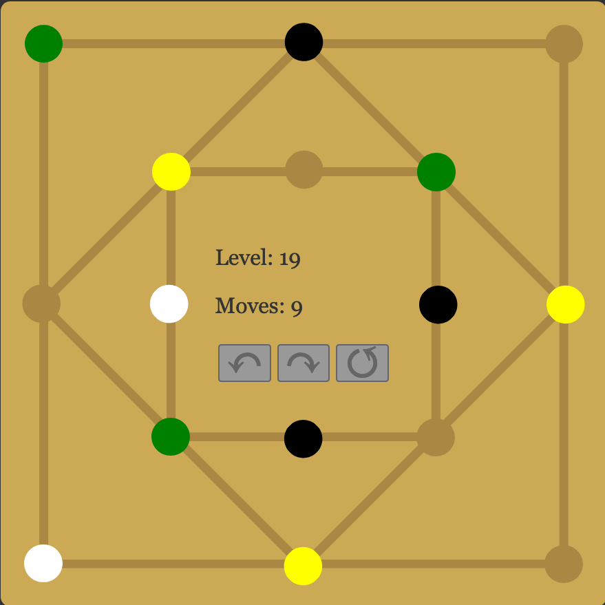

# Gemini Game Web App

A board game I fell in love with and wanted to get it in my browser.

## Disclaimer

I am **not** the inventor of that game and do **not** own the copyright for it. I only wrote this software implementation.

## The Original

The board game _Gemini_ was created by Dr. Oliver Schaudt and is manufactured by Gerhards Spiel und Design. If you like this software version you will love [the hardware version](https://www.spielewerkstatt.eu/de/startseite/177-gemini.html).

## How to Play

- Move the marbles along straight lines (simply click on the respective line).
- Only two neighboring marbles can be moved together.
- The puzzle is solved once all marbles of the same color (except for the white placeholder marbles) lie in straight rows.

## The Code

I started this as a [React App](https://create-react-app.dev/) with [one big JSX file](https://github.com/smnscp/web-gemini/blob/365bd40c32d5646e786cc81242da8e10a54f65de/src/gemini_game.jsx). Just out of curiosity whether I can use React for a simple browser game. As the project evolved I modularized the code, first [extracting level data](https://github.com/smnscp/web-gemini/commit/890d3b3affe10c8ed5db7eb71422de212a8d3c7f), later [moving every class to its own file](https://github.com/smnscp/web-gemini/commit/137ea1c77fff7e7fa62d726628016fd2ae76bf32). Having separated the game’s [data structures](https://github.com/smnscp/web-gemini/tree/main/src/model) and its [presentational components](https://github.com/smnscp/web-gemini/tree/main/src/view/react) from [the start](https://github.com/smnscp/web-gemini/blob/c646aff8befefc8cbf4fa29b273e2e21dea1e92b/gemini_game.js) that was easy. And so was [implementing Web Components](https://github.com/smnscp/web-gemini/commit/be28180fe5be01e0b96c4c5955b03a649f804331) as a drop-in replacement for the React components.

## Web Components vs. React

|  | Web Components version | React version |
| --- | --- | --- |
| live example | [index.html](https://gemini.sim.ilitu.de/) | [reactive.html](https://gemini.sim.ilitu.de/reactive.html) |
| source code | [src/view/web](src/view/web) | [src/view/react](src/view/react) |
| bundle size (Vite)[^bundle-size] | 4.67 kB (gzip: 1.35 kB) | 200.37 kB (gzip: 59.36 kB) |

[^bundle-size]: The additional model and data code bundle shared by both versions is 10.33 kB (gzip: 2.47 kB).